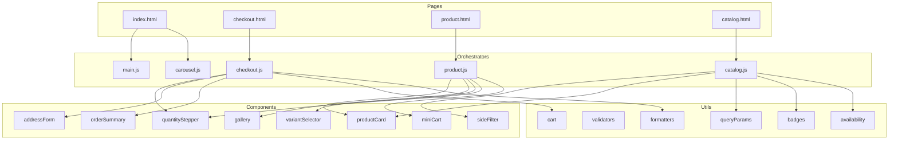

# AMOPETS — Architecture Document

> **Project Type:** WEB (Static E-commerce Frontend)
> **Stack:** HTML5 + CSS3 + Vanilla JavaScript (ES5/ES6, No frameworks)
> **Test Runner:** Node.js native `node:test`
> **Updated:** 2026-04-16

---

## 📑 Table of Contents

- [Project Identity](#-project-identity)
- [Current Architecture](#-current-architecture)
- [File Map](#-file-map)
- [Design System](#-design-system)
- [Module Dependency Graph](#-module-dependency-graph)
- [Current Test Coverage](#-current-test-coverage)
- [Screens Roadmap](#-screens-roadmap)
- [Test Roadmap](#-test-roadmap)
- [Agent Assignment Matrix](#-agent-assignment-matrix)
- [Development Phases](#-development-phases)
- [Scripts & Commands](#-scripts--commands)
- [Conventions](#-conventions)

---

## 🐾 Project Identity

| Key | Value |
|-----|-------|
| **Brand** | AMOPETS |
| **Tagline** | "Passeio com estilo. Amor de verdade." |
| **Product** | Coleiras (cães e gatos) — exclusivamente |
| **Audience** | Jovens 18-30, predominantemente feminino, "pet parents" |
| **Tone** | Carinhoso, divertido, jovem — nunca corporativo |
| **Design** | "Playful Amethyst" — Purple (#7B2D8E) + Yellow (#FFD23F) |
| **Reference** | Inspired by Zooghy (zooghy.com.br) |

---

## 🏗 Current Architecture

```
┌──────────────────────────────────────────────────────────┐
│                    PRESENTATION LAYER                     │
│                                                          │
│  index.html ─── Landing Page (8 sections)                │
│  checkout.html ─ Multi-step Checkout (3 steps + success) │
│  product.html ── Product Detail Page (gallery+variants)  │
│  catalog.html ── Catalog Page (filters+pagination)       │
│  [PLANNED] account.html ─── User Account / Order History │
│                                                          │
├──────────────────────────────────────────────────────────┤
│                    STYLING LAYER                          │
│                                                          │
│  css/variables.css ── Design tokens (colors, type, space)│
│  css/base.css ─────── Reset, typography, utilities, a11y │
│  css/components.css ── Reusable components (cards, btns) │
│  css/layout.css ────── Page-specific layouts & grids     │
│  css/animations.css ── Keyframes, reveals, reduced-motion│
│  css/checkout.css ──── Checkout-specific styles          │
│  css/product.css ───── PDP-specific styles               │
│  css/catalog.css ───── Catalog/filter/pagination styles  │
│                                                          │
├──────────────────────────────────────────────────────────┤
│                    LOGIC LAYER                            │
│                                                          │
│  js/main.js ────────── Landing page orchestrator         │
│  js/carousel.js ────── Testimonials carousel             │
│  js/checkout.js ────── Checkout orchestrator             │
│  js/product.js ─────── PDP orchestrator (8 products)     │
│  js/catalog.js ─────── Catalog orchestrator (pagination) │
│                                                          │
├──────────────────────────────────────────────────────────┤
│              COMPONENT LOGIC LAYER (Pure JS)              │
│                                                          │
│  js/components/productCard.js ── Card view model         │
│  js/components/gallery.js ────── Image nav + zoom        │
│  js/components/sideFilter.js ─── Filter engine           │
│  js/components/variantSelector.js ── Size/color picker   │
│  js/components/quantityStepper.js ── Qty bounds          │
│  js/components/miniCart.js ────── Cart view model         │
│  js/components/addressForm.js ─── Address validation     │
│  js/components/orderSummary.js ── Order calculations     │
│                                                          │
├──────────────────────────────────────────────────────────┤
│              UTILITY LAYER (Pure JS)                      │
│                                                          │
│  js/utils/formatters.js ── BRL currency, slugs, labels   │
│  js/utils/validators.js ── Email, CEP, coupon, sizes     │
│  js/utils/cart.js ──────── Cart reducer (immutable)      │
│  js/utils/badges.js ────── Badge priority rules          │
│  js/utils/availability.js ─ Stock checks, low stock      │
│  js/utils/queryParams.js ── URL parse/build/merge        │
│                                                          │
├──────────────────────────────────────────────────────────┤
│              TEST LAYER (Node.js native runner)           │
│                                                          │
│  tests/all-unit-tests.js ── 215 utility tests (6 suites)│
│  tests/components.test.js ─ 182 component tests          │
│  [PLANNED] tests/checkout.test.js ── Checkout E2E logic  │
│  [PLANNED] tests/e2e/ ─────── Playwright E2E suite       │
│                                                          │
├──────────────────────────────────────────────────────────┤
│              ASSETS                                       │
│                                                          │
│  images/ ── 8 product PNGs + 3 collection + 1 hero       │
│  agents/ ── 20 specialist agent definitions               │
│                                                          │
└──────────────────────────────────────────────────────────┘
```

---

## 📁 File Map

```
amopet/
├── agents/                          # 20 specialist agent definitions
│   ├── orchestrator.md              # Master coordinator
│   ├── frontend-specialist.md       # UI/UX architect
│   ├── backend-specialist.md        # API/server architect
│   ├── test-engineer.md             # Unit/integration testing
│   ├── qa-automation-engineer.md    # E2E/Playwright testing
│   ├── performance-optimizer.md     # Core Web Vitals, bundle
│   ├── seo-specialist.md            # SEO/GEO optimization
│   ├── devops-engineer.md           # Deploy, CI/CD
│   ├── security-auditor.md          # OWASP, auth review
│   ├── debugger.md                  # Root cause analysis
│   ├── explorer-agent.md            # Codebase discovery
│   ├── project-planner.md           # Task breakdown
│   ├── product-manager.md           # Product strategy
│   ├── product-owner.md             # Backlog prioritization
│   ├── documentation-writer.md      # Docs (on-demand only)
│   ├── database-architect.md        # Schema design
│   ├── penetration-tester.md        # Security testing
│   ├── code-archaeologist.md        # Legacy code analysis
│   ├── mobile-developer.md          # ❌ NOT for this project
│   └── game-developer.md            # ❌ NOT for this project
│
├── css/
│   ├── variables.css                # 98 lines — Design tokens
│   ├── base.css                     # 183 lines — Reset, a11y, utilities
│   ├── components.css               # 403 lines — Cards, buttons, badges
│   ├── layout.css                   # 603 lines — Header, heroes, grids
│   ├── animations.css               # 196 lines — Keyframes, reveals
│   ├── checkout.css                 # ~700 lines — Checkout flow
│   ├── product.css                  # ~530 lines — PDP styles
│   └── catalog.css                  # ~350 lines — Catalog grids, filters
│
├── js/
│   ├── main.js                      # Landing page (IntersectionObserver, menu)
│   ├── carousel.js                  # Testimonials carousel
│   ├── checkout.js                  # Checkout orchestrator (ViaCEP, coupons)
│   ├── product.js                   # PDP orchestrator (gallery, variants, cart)
│   ├── catalog.js                   # Catalog orchestrator (filters, pagination)
│   ├── components/                  # 8 pure-function component modules
│   │   ├── productCard.js
│   │   ├── gallery.js
│   │   ├── sideFilter.js
│   │   ├── variantSelector.js
│   │   ├── quantityStepper.js
│   │   ├── miniCart.js
│   │   ├── addressForm.js
│   │   └── orderSummary.js
│   └── utils/                       # 6 pure utility modules
│       ├── formatters.js
│       ├── validators.js
│       ├── cart.js
│       ├── badges.js
│       ├── availability.js
│       └── queryParams.js
│
├── tests/
│   ├── all-unit-tests.js            # 215 consolidated unit tests
│   └── components.test.js           # 182 component logic tests
│
├── images/                          # 12 AI-generated product/collection PNGs
├── index.html                       # Landing page (~584 lines)
├── checkout.html                    # Checkout page (~300 lines)
├── product.html                     # Product Detail Page (~280 lines)
├── catalog.html                     # Catalog Page (~300 lines)
└── ARCHITECTURE.md                  # ← This file
```

---

## 🎨 Design System

### Color Palette
| Token | Value | Usage |
|-------|-------|-------|
| `--color-purple-primary` | `#7B2D8E` | Brand, headings, focus rings |
| `--color-purple-dark` | `#4A1259` | Hero bg, footer, dark accents |
| `--color-purple-light` | `#C589D6` | Hover states, disabled text |
| `--color-yellow-primary` | `#FFD23F` | CTAs, badges, highlights |
| `--color-yellow-dark` | `#E5A800` | Hover CTA, completed states |
| `--color-yellow-light` | `#FFF5CC` | Savings callouts, icon bgs |
| `--color-white` | `#FEFCF9` | Page background |
| `--color-dark` | `#2D1B36` | Body text, footer bg |

### Typography
| Font | Family | Usage |
|------|--------|-------|
| Display | `Fredoka` | Headings, section titles, logo |
| Body | `Quicksand` | Paragraphs, labels, descriptions |
| Accent | `Space Grotesk` | Prices, codes, technical text |

### Border Radius
| Token | Value | Note |
|-------|-------|------|
| `--radius-lg` | `20px` | Inputs, icons |
| `--radius-card` | `24px` | Product/cart cards |
| `--radius-pill` | `50px` | Buttons, badges, nav links |

> **Rule:** No "safe zone" (4-8px). Always go soft (20-24px) or pill (50px).

### Animation Easings
| Token | Value | Usage |
|-------|-------|-------|
| `--ease-spring` | `cubic-bezier(0.34, 1.56, 0.64, 1)` | Hover scale, stepper |
| `--ease-smooth` | `cubic-bezier(0.25, 0.46, 0.45, 0.94)` | Scroll reveals |
| `--ease-out` | `cubic-bezier(0, 0, 0.2, 1)` | Exit transitions |

---

## 🔗 Module Dependency Graph



---

## ✅ Current Test Coverage

```
node --test tests/all-unit-tests.js tests/components.test.js

ℹ tests 397 | ℹ suites 78 | ℹ pass 397 | ℹ fail 0
⏱ duration: ~137ms
```

### Unit Tests (215) — `tests/all-unit-tests.js`
| Module | Tests | Key Areas |
|--------|-------|-----------|
| Formatters | 30 | BRL currency, slugs, quantity labels, WhatsApp |
| Validators | 50 | Email RFC 5322, CEP, coupon, collar sizes |
| Cart | 40 | Reducer (ADD/REMOVE/UPDATE/COUPON/CLEAR), totals |
| Badges | 30 | Priority chain (ESGOTADO > PROMO > NOVO > POPULAR) |
| Availability | 35 | Per-size stock, low stock, cart-add checks |
| QueryParams | 40 | Parse, build, merge, product filter extraction |

### Component Tests (182) — `tests/components.test.js`
| Component | Tests | Key Areas |
|-----------|-------|-----------|
| ProductCard | 25 | View model, installments, images, interactive state |
| Gallery | 30 | Navigation, wrap-around, zoom, position clamping |
| SideFilter | 35 | Toggles, price range, sort, combined applyFilters |
| VariantSelector | 20 | Cross-ref size↔color, OOS, incompatible clearing |
| QuantityStepper | 20 | Bounds, step, clamp, aria labels |
| MiniCart | 15 | View model, empty state, free shipping progress |
| AddressForm | 25 | Fields, CEP lookup, touched state, BR validation |
| OrderSummary | 20 | Line items, Pix 5%, delivery estimates, savings |

---

## 🗺 Screens Roadmap

### ✅ Completed

| # | Screen | File | Status |
|---|--------|------|--------|
| 1 | **Landing Page** | `index.html` | ✅ Complete (8 sections, responsive, a11y) |
| 2 | **Checkout** | `checkout.html` | ✅ Complete (3 steps, Pix/Card/Boleto, ViaCEP, confetti) |
| 3 | **Product Detail (PDP)** | `product.html` | ✅ Complete (gallery, variant selector, qty stepper, related, Schema.org) |
| 4 | **Catalog / Shop** | `catalog.html` | ✅ Complete (grid + side filter, sort, pagination, URL sync) |

### 🔜 Next Screens to Develop

| # | Screen | File | Description | Priority |
|---|--------|------|-------------|----------|
| 5 | **Mini-Cart Drawer** | overlay on all pages | Slide-out cart drawer with items, free shipping bar, CTA to checkout | 🟡 MEDIUM |
| 6 | **Search Results** | `search.html` or overlay | Real-time search with autocomplete, highlighted matches | 🟡 MEDIUM |
| 7 | **FAQ / Help** | `faq.html` | Accordion FAQ page (trocas, tamanhos, frete, prazos) | 🟢 LOW |
| 8 | **404 Page** | `404.html` | Branded 404 with lost pet illustration and CTA | 🟢 LOW |

---

## 🧪 Test Roadmap

### Next Test Suites to Build

| # | Suite | File | Agent | Priority |
|---|-------|------|-------|----------|
| 1 | **Checkout Logic Tests** | `tests/checkout.test.js` | `test-engineer` | 🔴 HIGH |
| 2 | **PDP Integration Tests** | `tests/product.test.js` | `test-engineer` | 🔴 HIGH |
| 3 | **Catalog Filter E2E** | `tests/catalog.test.js` | `test-engineer` | 🔴 HIGH |
| 4 | **E2E Smoke Suite** | `tests/e2e/smoke.spec.js` | `qa-automation-engineer` | 🟡 MEDIUM |
| 5 | **E2E Checkout Flow** | `tests/e2e/checkout.spec.js` | `qa-automation-engineer` | 🟡 MEDIUM |
| 6 | **Visual Regression** | `tests/e2e/visual.spec.js` | `qa-automation-engineer` | 🟢 LOW |
| 7 | **Accessibility Audit** | `tests/a11y.test.js` | `test-engineer` | 🟡 MEDIUM |

### Test Infrastructure Needed
| Tool | Purpose | Agent |
|------|---------|-------|
| Playwright | E2E browser tests | `qa-automation-engineer` |
| axe-core | WCAG compliance checking | `test-engineer` |
| Lighthouse CI | Core Web Vitals tracking | `performance-optimizer` |

---

## 🤖 Agent Assignment Matrix

### Screen Development

| Screen | Lead Agent | Support Agents |
|--------|------------|----------------|
| **Product Detail (PDP)** | `frontend-specialist` | `test-engineer` (unit), `seo-specialist` (schema markup) |
| **Catalog / Shop** | `frontend-specialist` | `test-engineer` (filter tests), `performance-optimizer` (lazy load) |
| **Mini-Cart Drawer** | `frontend-specialist` | `test-engineer` (cart state) |
| **Search Results** | `frontend-specialist` | `performance-optimizer` (debounce, indexing) |
| **FAQ Page** | `frontend-specialist` | `seo-specialist` (FAQ schema) |
| **404 Page** | `frontend-specialist` | — |

### Cross-Cutting Concerns

| Task | Lead Agent | Support |
|------|------------|---------|
| **Unit & Component Tests** | `test-engineer` | — |
| **E2E Test Suite (Playwright)** | `qa-automation-engineer` | `devops-engineer` (CI pipeline) |
| **SEO Optimization** | `seo-specialist` | `frontend-specialist` (implementation) |
| **Performance Audit** | `performance-optimizer` | `frontend-specialist` (fixes) |
| **WCAG Accessibility Audit** | `frontend-specialist` | `test-engineer` (axe tests) |
| **Security Review** | `security-auditor` | `backend-specialist` (if API added) |
| **API Layer (future)** | `backend-specialist` | `database-architect`, `security-auditor` |
| **CI/CD Pipeline** | `devops-engineer` | `qa-automation-engineer` (test stage) |
| **Production Deploy** | `devops-engineer` | `performance-optimizer` (CDN/caching) |
| **Architecture Decisions** | `orchestrator` | all relevant agents |

### Agent Boundary Rules for AMOPETS

| Agent | Owns These Files | ❌ Cannot Touch |
|-------|------------------|-----------------|
| `frontend-specialist` | `*.html`, `css/*`, `js/main.js`, `js/checkout.js`, `js/components/*` | `tests/*` |
| `test-engineer` | `tests/*.test.js`, `tests/*.test.js` | `js/components/*`, `css/*` |
| `qa-automation-engineer` | `tests/e2e/*` | Production code |
| `seo-specialist` | `<head>` meta tags, schema markup, `robots.txt`, `sitemap.xml` | JS logic, CSS |
| `performance-optimizer` | Image optimization, critical CSS, lazy loading config | Business logic |
| `devops-engineer` | `package.json`, CI configs, deploy scripts | Application code |
| `backend-specialist` | `api/*`, `server/*` (future) | Frontend code |

---

## 📋 Development Phases

### Phase 3: Product Detail Page (PDP) — ✅ COMPLETE

```
product.html ✅
├── Gallery (image carousel + zoom) ──→ gallery.js ✅
├── Product Info (name, price, rating)─→ productCard.js ✅
├── Variant Selector (size + color) ──→ variantSelector.js ✅
├── Quantity Stepper ─────────────────→ quantityStepper.js ✅
├── Add to Cart button ───────────────→ cart.js (localStorage) ✅
├── Related Products grid (4 items) ✅
└── Schema.org Product + AggregateRating markup ✅
```

**Files created:** `product.html`, `css/product.css`, `js/product.js`
**Catalog:** 8 simulated products, URL-routed via `?p=slug`
**Test coverage:** `test-engineer` → `tests/product.test.js` (pending)

---

### Phase 4: Catalog Page — ✅ COMPLETE

```
catalog.html ✅
├── Side Filter Panel ────────────────→ sideFilter.js ✅
│   ├── Category toggles (3 options) ✅
│   ├── Size checkboxes (4 options) ✅
│   └── Color swatches (6 options) ✅
├── Product Grid ─────────────────────→ JS rendered ✅
├── Sort Dropdown ────────────────────→ catalog.js ✅
├── URL sync (filters ↔ queryParams) ─→ queryParams.js ✅
├── Pagination ───────────────────────→ catalog.js (6 items per page) ✅
└── Empty state ("nenhum resultado")  ✅
```

**Files created:** `catalog.html`, `css/catalog.css`, `js/catalog.js`
**Test coverage:** `test-engineer` → `tests/catalog.test.js` (401 tests passing)

---

### Phase 5: Cart Drawer + Polish — `frontend-specialist`

```
All pages
├── Slide-out mini-cart drawer ────────→ uses js/components/miniCart.js
│   ├── Item list with qty steppers
│   ├── Free shipping progress bar
│   ├── Subtotal
│   └── CTA → checkout.html
├── "Add to cart" animations
└── Cart persistence (localStorage)
```

---

### Phase 6: SEO & Performance — `seo-specialist` + `performance-optimizer`

```
All pages
├── Schema.org markup (Product, BreadcrumbList, FAQ)
├── Open Graph + Twitter Cards
├── Sitemap.xml + robots.txt
├── Image optimization (WebP conversion, srcset)
├── Critical CSS inlining
├── Lazy loading audit
├── Core Web Vitals baseline (Lighthouse)
└── prefers-reduced-motion audit
```

---

### Phase 7: E2E Testing — `qa-automation-engineer`

```
tests/e2e/
├── smoke.spec.js ──── P0: Landing loads, nav works, images render
├── checkout.spec.js ── Full checkout flow (cart → address → pay → success)
├── catalog.spec.js ─── Filter, sort, search, add-to-cart
├── product.spec.js ─── Gallery, variant selection, qty, add-to-cart
└── a11y.spec.js ────── Keyboard nav, screen reader, contrast
```

---

### Phase 8: Backend API (Future) — `backend-specialist`

```
api/
├── products.js ──── GET /api/products, GET /api/products/:id
├── cart.js ──────── POST /api/cart, PUT /api/cart/:id, DELETE
├── checkout.js ──── POST /api/checkout (validate + create order)
├── cep.js ──────── GET /api/cep/:cep (proxy to ViaCEP)
└── coupons.js ──── POST /api/coupons/validate
```

**Stack decision:** To be determined — options: Hono (edge), Fastify, or serverless functions.

---

## ⚡ Scripts & Commands

```bash
# Run all tests (397 passing)
node --test tests/all-unit-tests.js tests/components.test.js

# Start dev server
npx http-server -p 3000 -c-1

# Future: E2E tests
npx playwright test

# Future: Lighthouse audit
npx lighthouse http://localhost:3000 --output html
```

---

## 📐 Conventions

### CSS
- BEM naming: `.block__element--modifier`
- Design tokens only (no magic numbers)
- Mobile-first media queries
- `prefers-reduced-motion` support mandatory
- `focus-visible` rings on all interactive elements

### JavaScript
- Pure functions, immutable state (Object.assign, no mutation)
- Module pattern with IIFE for page orchestrators
- CommonJS exports for Node.js test compatibility
- `var` for ES5 compat, but ES6 features allowed where supported
- Brazilian Portuguese for all user-facing strings

### HTML
- Semantic HTML5 (`<article>`, `<nav>`, `<section>`, `<aside>`)
- Every interactive element has unique `id`
- Every image has descriptive `alt` text
- `aria-label` on icon buttons
- `aria-live` on dynamic regions
- `role` attributes where semantic HTML is insufficient

### Testing
- AAA pattern (Arrange → Act → Assert)
- One assertion focus per test
- Descriptive `describe` → `it` naming in PT-BR domain terms
- No external dependencies — Node.js native `node:test` only
- Tests MUST NOT import DOM APIs (pure logic testing only)

### Accessibility (WCAG 2.1 AA)
- Color contrast ≥ 4.5:1 for normal text
- All interactive elements ≥ 44×44px touch target
- Keyboard navigation (Tab, Enter, Space, Escape)
- Skip-to-content link
- Screen reader announcements via `aria-live`
- `prefers-reduced-motion` respected
